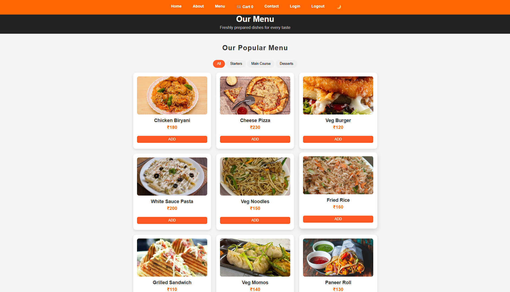
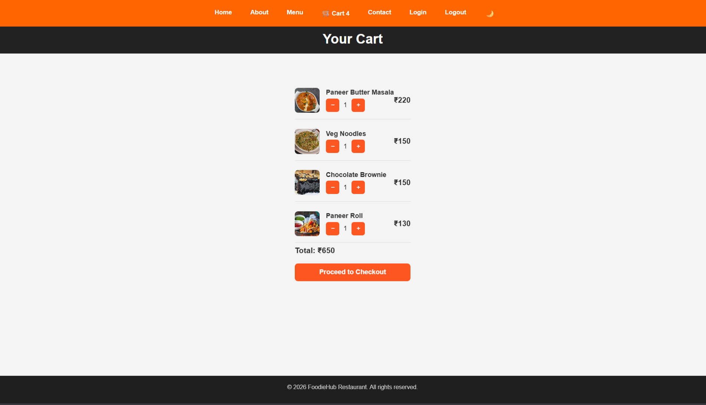

# 🍽 FoodieHub – Online Food Ordering Website

FoodieHub is a modern food ordering web application inspired by platforms like **Swiggy** and **Zomato**.
Users can browse the menu, add items to the cart, and proceed to checkout.

---

## 🚀 Features

* 🔐 Firebase Authentication (Login / Logout)
* 🍔 Interactive Food Menu
* 🛒 Swiggy-style Cart System (+ / − buttons)
* 📦 Floating Cart Bar
* 📑 Separate Cart Page
* 🌙 Dark Mode Toggle
* 📱 Responsive Design
* 📲 PWA Support (Installable Web App)
* ☁ Firebase Hosting Deployment

---

## 🖥 Technologies Used

* HTML5
* CSS3
* JavaScript
* Firebase Authentication
* Firebase Hosting
* LocalStorage (Cart System)

---

## 📸 Screenshots

### Menu Page



### Cart Page



---

## ⚙ How to Run Locally

Clone the repository:

```
git clone https://github.com/YOUR_USERNAME/foodiehub.git
```

Open the project folder and start a local server:

```
firebase serve
```

Then open:

```
http://localhost:5000
```

---

## 🌐 Live Demo

Firebase Hosted Site:

```
https://food-ordering-login-50ad9.web.app
```

---

## 👨‍💻 Author

Developed by **Anuj Purbe**

---
